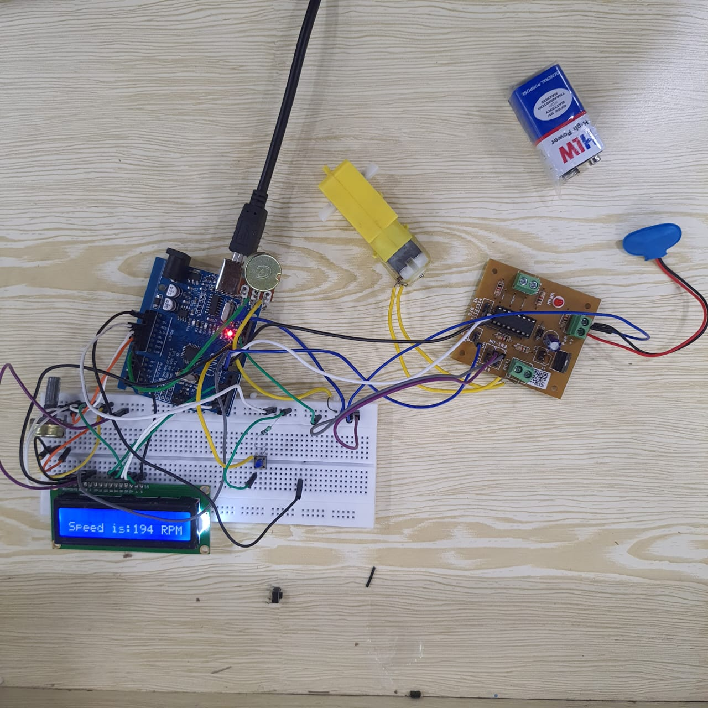

# MAKEATHON SUBMISSION : Ebike speed controller system as per its throttle using Microcontroller.

 ### About 
  This project is all aboutTo design a smart electric bike speed control system using a microcontroller and a throttle input that can be controlled and can provide real time feedback to the rider. The throttle input will be implemented using a potentiometer. 

# Pre-requisites
Install Arduino IDE and gather required components.

# Steps to run the program :
 1. Make the circuit connections.
 2. Connect the microcontroller to the pc.
 3. Upload the code using arduino ide.
 4. Rotate the potentiometer (throttle).
 5. For normal riding mode : the push button should be pressed.
 6. For city/economy riding mode : the push button should be released.
 7. The LCD reflects the speed of the motor. 
 
 # Screenshots:-
 
 ### Prototype of project 
  
 
 ### Normal Riding Mode  
  

 ### City/Economy Mode 
  
 
 

